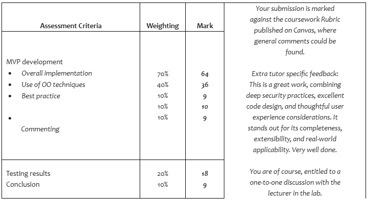

# 4214COMP - 202425 - SEM - 2 - Problem Solving For Computer Security
-------------------------------------------------------------------
This piece of coursework challenged us to apply our newfound Java programming skills to create a piece of security-based software. While we had some pre-defined options, such as encryption tools, IP scanners, or login systems. I personally chose to create an encryption tool.
My project combined a few features that I wanted to experiment with:

-	File encryption: the user is able to encrypt and decrypt files using multiple different algorithms
-	Hashing: I wanted to experiment with making my own hashing algorithm to understand them more deeply
-	Login system: users are able to log in and create an account, with each user having a specific view of the data stored, meaning which files they can encrypt and decrypt

The result of this was a large piece of command line-based software which was able to encrypt and decrypt chosen text files. 

It employed a flat file database system to store the account data and file data. This allows the system to handle log ins/log outs, and to manage the encrypted files, setting priorities, assigning ownership, and remembering passwords.

Passwords are stored appropriately, with many layers of SHA256 hashing and salting. 

Encryption keys are generated via my own hashing algorithm, wherein the chosen password is hashed, and cropped to an appropriate length. I developed this hashing algorithm independently as an experiment, so I decided to include it within this coursework to test its applicability. While far from secure by any means, it was a fun test, and deepened my understanding of hashing algorithms. A version of this algorithm has been included in a separate repository.

Other functionalities included where a password strength checker, which is a relatively simple string reading algorithm that enforces certain rules. An input validation system, which removes the possibility for users to input the wrong data, and mostly exists to clean up the code in the main system. 
-------------------------------------------------------------------
## Results
-------------------------------------------------------------------
I received 91% as the result for this coursework, the results transcript/ feedback is attached. 

I certainly learned a lot from working on this project, both in terms of larger-scale project management, and raw security principles when implemented in code, such as string encoding when encrypting, and data loss warping encryption keys. It was a very valuable experience.

